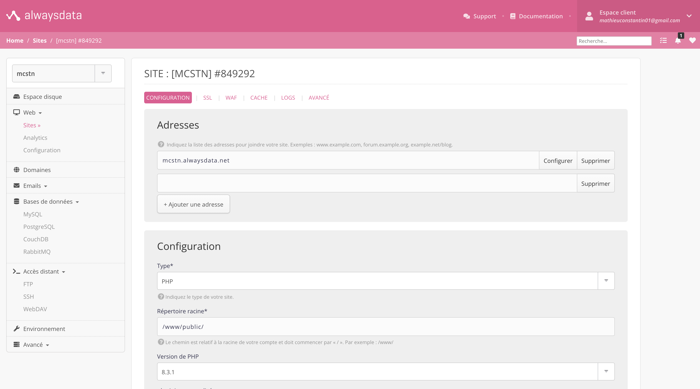
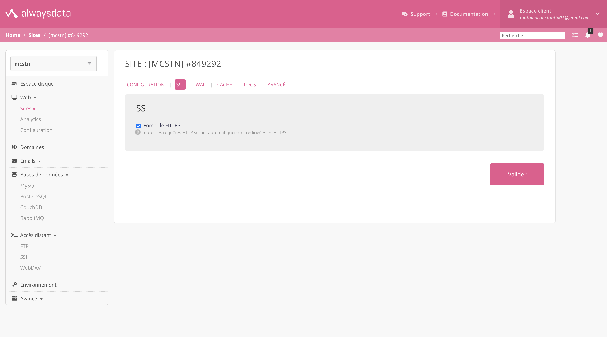

# Configurer son serveur Alwaysdata

Dans l'onglet **Web > Sites** vous trouverez votre premier site avec le patern "votre-site.alwaysdata.net". Suivé les instructions :

- Allez dans les réglages de votre site (icon en forme d'engrenage) et dans l'onglet **CONFIGURATION** et la section **Configuration** indiqué le chemin `/www/public/`
- Allez dans l'onglet SSL et cochet la case :
  - [x] Forcer le HTTPS
- Pensez à valider vos modifications

