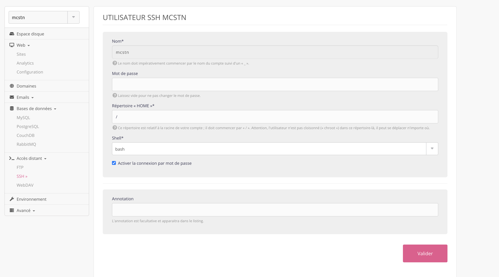
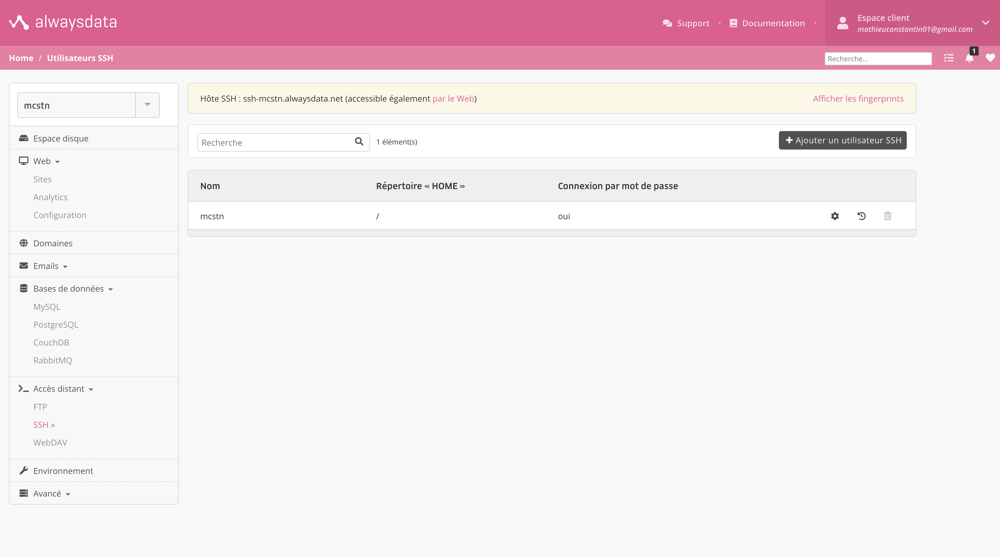

# Se connecter sur alwaysdata via SSH

## Prérequis

Avant de se connecter via SSH il est nécessaire de configurer un utilisateur SSH et son mot de passe.

Par défaut vous retrouverez déjà un utilisateur SSH dans l'onglet **SSH** (à gauche sur le tableau de bore d'alwaysdata).

Dans cette interface cliqué sur l'icon d'engrenage au niveau de l'utilisateur SSH et définissez-y le mot de passe de connection.

Toujours dans cette interface, cochez la case :
- [x] **Activer la connexion par mot de passe**

Pensez à valider vos modifications sur le bouton en bas à droite de l'interface :



### récupérer les informations de connection

Pour se connecter via SSH, il vous faudra récupérer : 
- Votre nom d'utilisateur SSH 
- Et votre hôte

Maintenant que nous avons toute les cartes en main, il est temps d'employer la commande `ssh` dans notre terminal.

# Connection via SSH

Dans votre terminal, metté à jour la commande suivante avec vos informations de connection :

```shell
ssh [utilisateur_ssh]@[hote]
```

Dans mon cas, ça resemble à :

```shell
ssh mcstn@ssh-mcstn.alwaysdata.net
```

## Première connection

Notre système ne reconnait pas l'hôte, il nous affiche la clé de l'empreinte qui ressemble à quelque chose comme ça : `SHA256:atOScYh1NQt0jReKkkZAbHbveNtvevco2X15LUINsEc`, et nous demande s'il on se connecte quand même au serveur.

Trois options s'offre à vous :

- Soit vous comfirmez avec `yes`,
- Soit vous déclinez,
- Soit vous copié/collé le fingerprint indiqué dans votre espace admin d'alwaysdata, depuis le déroulant **"Afficher les fingerprints"** qui correspond à votre type de clé crypté en **SHA256**.
  

> [!TIP]
> Si votre système vous demande cette confirmation c'est pour éviter les cyber-attaques de type **"man of the middle"**; La troisième option servant à comparer les fingerprints au cas où un individu mal-intentionné essairait de se faire passer pour votre serveur.

Je vous laisse le soin de choisir l'option adaptée.

Si vous avez comfirmé le fingerprint (options `yes` ou `[fingerprint]`), votre système ne devrait plus vous le demander à l'avenir.

Si tous ses bien passé, il ne vous reste plus qu'a renseigner votre mot de passe et vous voilà identifier sur votre serveur.